# Technical Architecture Specification — titonium

`titonium` is a high-performance, modular desktop shell environment engineered for **Wayland + Hyprland**, built upon the **Quickshell (Qt 6 / QML)** declarative engine.

---

## 1. System Architecture & Data Flow

```mermaid
graph TD
    subgraph OS_Layer ["Operating System & Hardware"]
        HW["Linux Kernel /sys, /proc"]
        DBUS["D-Bus (org.freedesktop.Notifications, MPRIS)"]
        HYPR["Hyprland IPC (hyprctl, sockets)"]
        PW["PipeWire / WirePlumber"]
        NM["NetworkManager (nmcli)"]
        CLIP["Wayland Clipboard (wl-paste, wl-copy)"]
        RSS["Google News RSS Feeds"]
    end

    subgraph Service_Layer ["Reactive Singleton Services (services/)"]
        ActiveWindowService
        AudioService
        ClipboardService
        LunarService
        NewsService
        NotificationService
        SettingsService
        SpotlightService
        SystemInfoService
        SystemStatusService
        WeatherService
        WindowSwitcherService
    end

    subgraph UI_Layer ["Windows & Components (windows/ & components/)"]
        ScreenFrame["ScreenFrame (WlrLayer.Bottom)"]
        BarExclusion["BarExclusionZone (WlrLayer.Top)"]
        TopBar["TopBar (WlrLayer.Top)"]
        Spotlight["Spotlight Launcher (WlrLayer.Overlay)"]
        NotificationCenter["NotificationCenter (WlrLayer.Overlay)"]
        NotificationPopup["NotificationPopup (WlrLayer.Overlay)"]
        WindowSwitcher["WindowSwitcher (WlrLayer.Overlay)"]
    end

    OS_Layer --> Service_Layer
    Service_Layer --> UI_Layer
```

### Architectural Principles:
1. **Unidirectional Data Flow**: Operating system state is polled or listened to via event-driven singletons in `services/`. UI components bind to exposed reactive properties; components never directly invoke raw CLI polling.
2. **Unified Focus Management**: TopBar consolidates popup focus into a single dynamic grab keyed to `window.hasOpenPopup`, completely preventing Hyprland exclusive seat focus locks on client applications.
3. **Dynamic Region Masking (`mask: Region`)**: Fullscreen overlay windows catch input clicks exclusively on interactive cards or dropdowns. Unfocused areas allow click-through transparency to underlying Hyprland tiled windows.
4. **Dynamic Slide-Push Toast Layout**: Toasts operate on an independent layer surface with real-time horizontal margin animations (`250ms Easing.OutCubic`) responding to drawer state.
5. **Zero Idle Overhead (Ref-Counted Polling)**: Hardware monitoring (CPU/GPU temperatures, memory deltas) and visualizer animations automatically pause when popups/dashboards are closed.

---

## 2. Windows & Layer-Shell Hierarchy

All top-level windows instantiate per monitor via `Variants { model: Quickshell.screens }`.

| Window | File | Layer | Namespace | Keyboard Focus | Purpose |
| :--- | :--- | :--- | :--- | :--- | :--- |
| **Screen Frame** | `ScreenFrame.qml` | `Bottom` | `titonium-frame` | `None` | 2D Canvas rendering 5px rounded screen borders and top bar base |
| **Bar Exclusion**| `BarExclusionZone.qml` | `Top` | `titonium-bar-exclusion` | `None` | Reserves 40px exclusive zone for Hyprland window tiling |
| **TopBar** | `TopBar.qml` | `Top` | `titonium-topbar` | `None` | Primary status bar containing widgets and interactive dropdowns |
| **Spotlight** | `Spotlight.qml` | `Overlay` | `titonium-spotlight` | `Exclusive` (when open) | Universal floating search bar, Raycast Split-View clipboard, math calculator |
| **Notification Center** | `NotificationCenter.qml` | `Overlay` | `titonium-nc` | `None` | Slide-in drawer with Today tab, Live News, Lunar Wisdom, and Notification queue |
| **Notification Popup** | `NotificationPopup.qml` | `Overlay` | `titonium-notification-popup` | `None` | Toast notification overlay with auto-dismiss timeout and slide-push animation |
| **Window Switcher** | `WindowSwitcher.qml` | `Overlay` | `titonium-window-switcher` | `Exclusive` (when open) | Alt+Tab visual multitasking window switcher |

---

## 3. Core Services Inventory (`services/`)

All services are declared as singletons via `pragma Singleton` and registered in `services/qmldir`.

### 1. `SpotlightService.qml`
- **Search Modes**:
  - `0 (All)`: System desktop applications (`DesktopEntries`), safe instant math evaluation, and system control actions.
  - `1 (Clipboard)`: Reactive clipboard search with Raycast-style 2-column Split-View.
  - `2 (Files)`: Quick directory shortcuts and document search.
- **Mode Cycling**: `Keys.onTabPressed` or chip click triggers `cycleMode()`.
- **IPC Interface**: `qs -c titonium ipc call spotlight toggle|open|close|clipboard`.

### 2. `ClipboardService.qml`
- **Capture Engine**: Background `Process` using `wl-paste --no-newline` with null-byte splitting (`splitMarker: "\0"`) preserving multiline paragraphs and code snippets intact.
- **Smart Content Classifier**: Automatically tags items as `url`, `color` (with live hex swatch preview), `code`, or `text`.
- **Metadata**: Tracks line count, word count, character count, and human-readable relative timestamps.
- **Capacity**: Maintains a rolling queue of up to 60 items.

### 3. `NewsService.qml`
- **Live Google News Parser**: Asynchronous RSS headline fetcher supporting multi-topic feeds (*Tech*, *Nation*, *Sports*, *World*).
- **Auto-Locale Adaptation**: Dynamically switches feed endpoint (`en-US` vs `vi-VN`) based on `I18n.locale`.
- **Relative Timestamp Engine**: Live localized formatting (`just now`, `15m ago`, `2h ago`).

### 4. `LunarService.qml`
- **Astronomical Solar-to-Lunar Converter**: Accurate Julian Day Number algorithms computing lunar month, day, leap months, and Can Chi year cycles.
- **Dual-Language Wisdom Engine**: Contextual daily quotes mapped to lunar cycles (New Moon, Full Moon, and closing lunar days).

### 5. `ActiveWindowService.qml`
- Tracks Hyprland's focused window via `hyprctl -j activewindow` (debounced 120ms).
- Heuristic icon resolution: StartupWMClass map ➔ `DesktopEntries.heuristicLookup` ➔ system theme icon fallback.

### 6. `AudioService.qml`
- Native PipeWire / WirePlumber node integration via Quickshell audio bindings.
- Exposes volume controls, mute toggling, and audio sink/source switching.

### 7. `SystemStatusService.qml`
- High-efficiency system resource monitor (`/proc/stat`, `/proc/meminfo`, sysfs GPU, `sensors -j`).
- Reference-counted lifecycle: Heavy polling only runs while consumers hold an active lease (`acquireMonitoring()`).

### 8. `NotificationService.qml`
- Implements the `org.freedesktop.Notifications` D-Bus interface.
- Manages persistent notification retention in `server.trackedNotifications`, per-screen activations, and synchronized dismissal.

### 9. `SettingsService.qml`
- Persists user preferences and personalization settings (e.g. `avatarIcon`) to `~/.config/titonium/settings.json`.
- Event-driven two-way binding using `FileView` and atomic file serialization.

### 10. `SystemInfoService.qml`
- Hardware & environment specification retriever (`/proc/cpuinfo`, sysfs GPU devices, `hostname`, shell, pacman packages, Wayland compositor name).

### 11. `WindowSwitcherService.qml`
- Uses `ToplevelManager` to inspect, cycle, and activate running Wayland toplevel windows with fail-safe Hyprland submap resets.

---

## 4. UI Components Specification (`components/`)

### Bar Widgets (`components/bar/`):
- `LauncherWidget.qml`: 960px × 540px 16:9 Launchpad with 260px category sidebar and fluid Apple-style horizontal page transitions.
- `WorkspaceWidget.qml`: 5-cell workspace switcher synchronized with `Hyprland.monitorFor(screen)`.
- `ActiveWindowWidget.qml`: Running application badge with truncated window title and hover info panel.
- `MediaWidget.qml`: Audiophile media pill with real-time marquee and popup card featuring **48-bar dynamic spectrum visualizer** and seekbar.
- `StatusWidget.qml`: Input method badge (EN / VI).
- `MonitorWidget.qml`: System metrics dropdown (CPU, GPU, RAM, Load Average).
- `AudioWidget.qml`: Audio volume level, mute toggle, and device output switcher.
- `BluetoothWidget.qml`: Bluetooth adapter status, discovery, and paired device manager.
- `WifiWidget.qml`: NetworkManager Wi-Fi scanner and connection list.
- `ClockWidget.qml`: Swiss Haute Horlogerie 204px borderless dial, luminous sword hands, sweeping needle, and Đà Nẵng timezone indicator.
- `NotificationWidget.qml`: Notification bell badge with unread counter.

### Primitives & Popups (`components/primitives/` & `components/popups/`):
- `AudioVisualizer.qml`: Harmonic 48-bar spectrum equalizer synthesizing rhythmic bass pulses and theme gradient transitions.
- `MaterialIcon.qml`: Material Symbols Rounded icon component with variable font axis scaling.
- `PopupPanel.qml`: Liquid Glass backdrop with Top Ambient Caustic Glow, 1.5px Specular Rim Sheen, and soft macOS Gaussian shadows.
- `PanelCard.qml`: Reusable glass card primitive with subtle borders and rounded corners.

---

## 5. Design Tokens, Theming & Localization (`config/`)

### 1. `config/Metrics.qml` (Layout & Sizing Tokens)
- **Window & Card Dimensions**: `barHeight (40)`, `widgetHeight (30)`, `widgetSpacing (4)`, `innerRadius (20)`, `spotlightWidth (620)`, `spotlightSplitWidth (720)`, `spotlightSearchHeight (56)`, `spotlightItemHeight (52)`, `clockDialSize (200)`.
- **Spacings & Margins Scale**: `spacingXs (4)`, `spacingSm (8)`, `spacingMd (12)`, `spacingLg (16)`, `spacingXl (24)`.
- **Corner Radii Scale**: `radiusXs (4)`, `radiusSm (6)`, `radiusMd (10)`, `radiusLg (12)`, `radiusXl (16)`, `radiusCard (20)`, `radiusPill (22)`.
- **Animation Durations**: `animFast (120ms)`, `animNormal (180ms)`, `animSlow (260ms)`.

### 2. `config/Typography.qml` (Type Scale & Weights)
- **Font Families**: `fontFamily ("SF Pro Display")`, `monoFontFamily ("JetBrains Mono, SF Mono, monospace")`.
- **Type Scale**: `sizeMicro (10)`, `sizeCaption (11)`, `sizeBodySm (12)`, `sizeBody (13)`, `sizeBodyLg (14)`, `sizeTitleSm (16)`, `sizeTitle (18)`, `sizeTitleLg (22)`, `sizeDisplay (32)`.
- **Font Weights**: `weightNormal (400)`, `weightMedium (500)`, `weightDemiBold (600)`, `weightBold (700)`.

### 3. `config/I18n.qml` (Localization Engine)
- Centralized string translation engine: `I18n.t(key, params)`.
- Comprehensive `"en"` and `"vi"` dictionaries supporting news, wisdom, clock, spotlight, launcher, and system actions.

### 4. `config/Theme.qml` & `themes/` (Semantic Color Palettes)
- **Semantic Colors**: `borderSubtle`, `borderDefault`, `surfaceHover`, `surfaceHoverStrong`, `surfaceActive`, `badgeBackground`, `textPrimary`, `textSecondary`.
- **macOS Soft Drop Shadows**: `popupShadowColour` tuned to `0.38` alpha with `32px` Gaussian blur.
