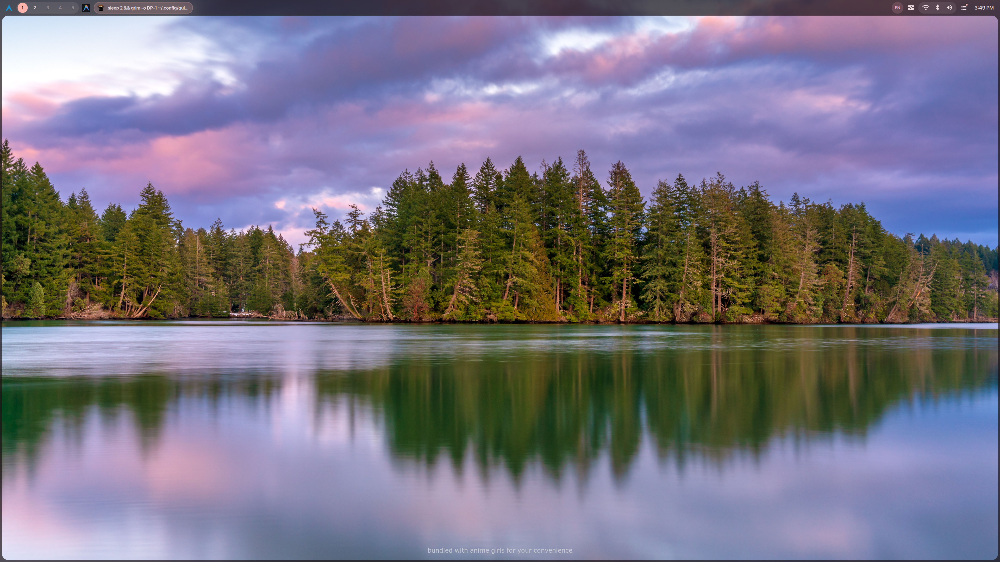
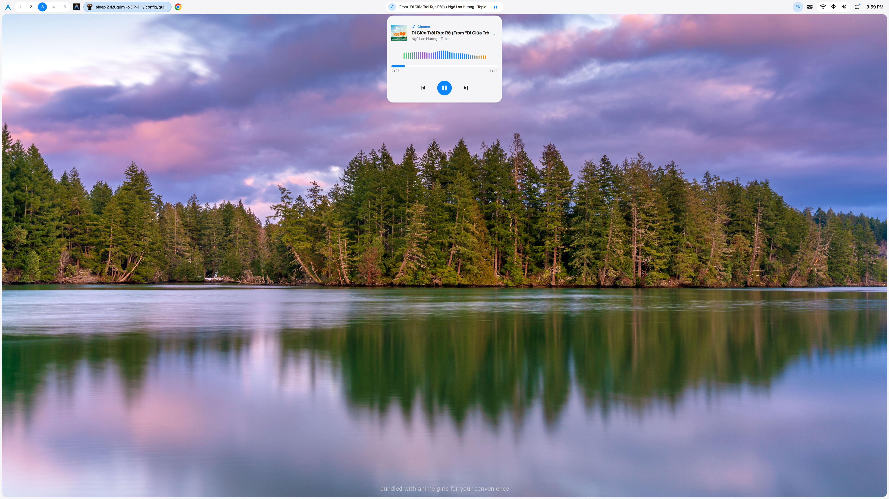
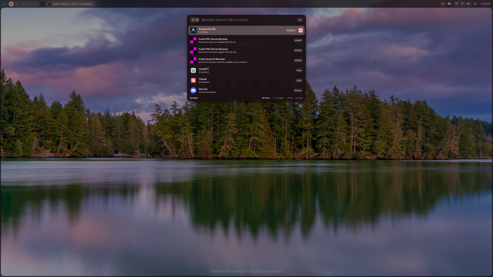
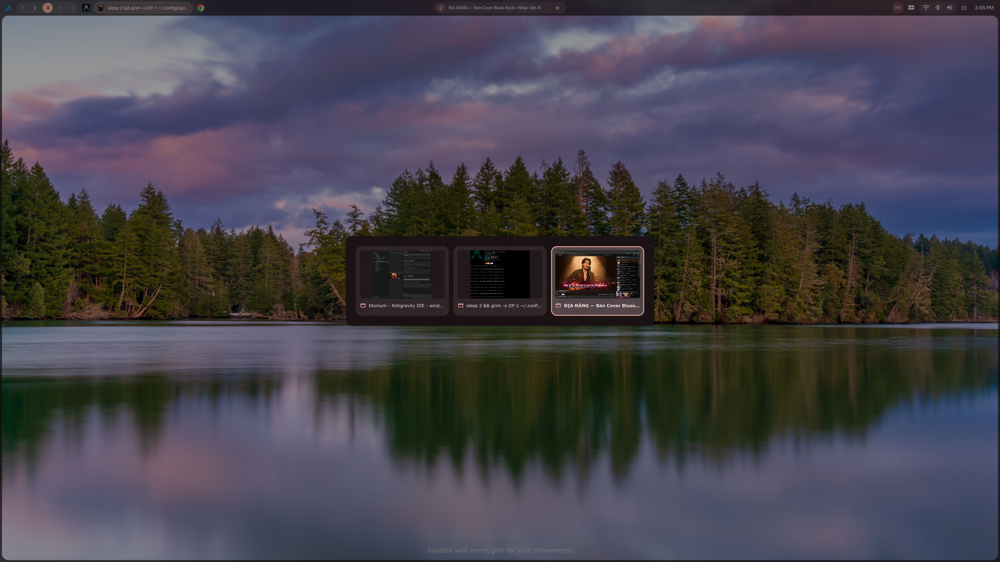
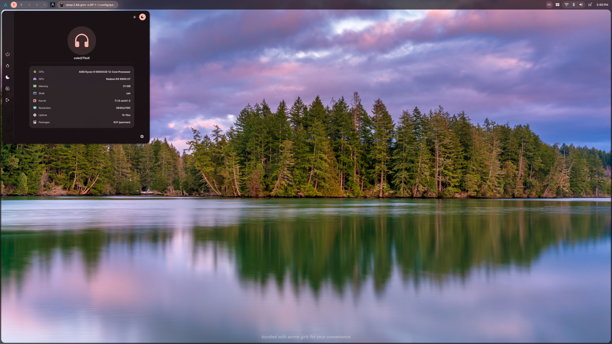
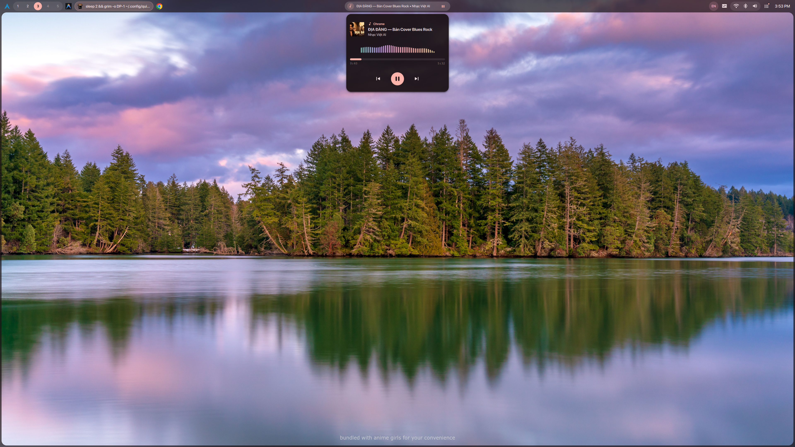
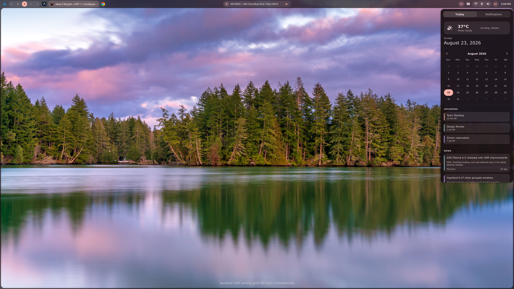
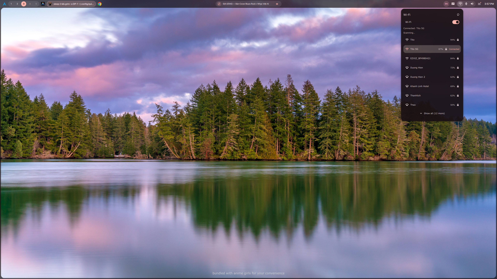
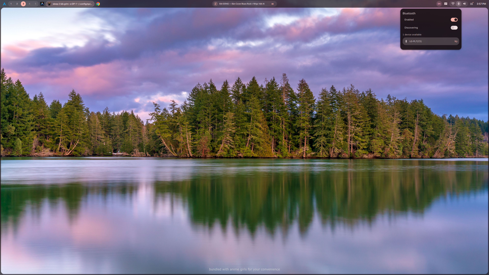
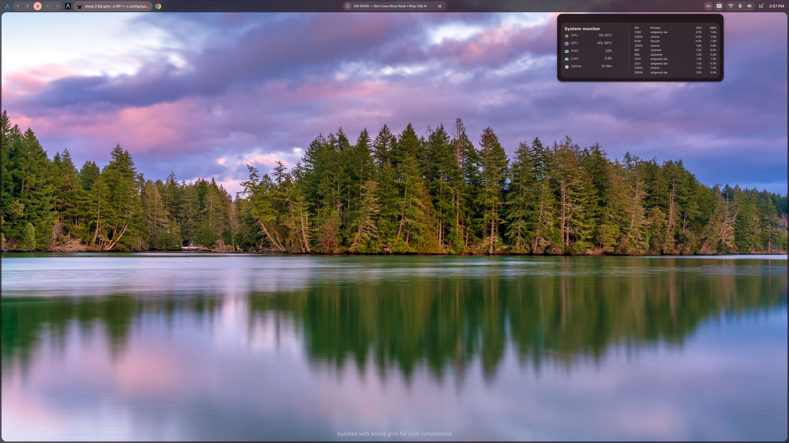

# 🌸 titonium

> A modern, modular desktop shell for **Wayland + Hyprland**, built with **Quickshell (Qt 6 / QML)**.

---

## 📸 Preview & Screenshots

| Dark Mode (Default) | Light Mode |
| :---: | :---: |
|  |  |

<br/>

| Spotlight Launcher (`SUPER + SPACE`) | Alt+Tab Window Switcher (`SUPER + TAB`) |
| :---: | :---: |
|  |  |

| System Dashboard & Controls | Media Player & 3-Mode Visualizer |
| :---: | :---: |
|  |  |

| Notification Center & Calendar |
| :---: |
|  |

| Wi-Fi Network Menu | Bluetooth Devices | System Resource Monitor |
| :---: | :---: | :---: |
|  |  |  |

> 💡 **Tip:** Place demonstration videos into `assets/videos/` or drag-and-drop your video into GitHub release notes / issues to embed it directly.

---

## ✨ Key Features

### 🖥️ 1. Screen Frame & TopBar
- **Screen Frame (`ScreenFrame.qml`)**: 5px system border with smooth rounded display corners.
- **TopBar (`TopBar.qml`)**: Floating bar with blur effect, drop shadows, and responsive widget layout.
- **Workspace Switcher (`WorkspaceWidget.qml`)**: 5-cell workspace indicator synchronized across Hyprland outputs.
- **Active Window Badge (`ActiveWindowWidget.qml`)**: Truncated active application title with hover inspection card.
- **System Monitoring Dropdown (`MonitorWidget.qml`)**: Real-time CPU, GPU, RAM, Temperature, and Load Average.
- **Input Method Indicator (`StatusWidget.qml`)**: Fcitx5 layout switcher badge (EN / VI).
- **Quick Settings Dropdowns**:
  - 🔊 **PipeWire Audio Control (`AudioWidget.qml`)**: Volume sliders, mute toggle, and audio sink/source switcher.
  - 📶 **NetworkManager Scanner (`WifiWidget.qml`)**: Wi-Fi access point discovery, signal strength, and network list.
  - 🛜 **Bluetooth Manager (`BluetoothWidget.qml`)**: Adapter status, device discovery, and paired device switcher.

---

### 🔔 2. Notification System (D-Bus `org.freedesktop.Notifications`)

#### 🗂️ Vertical Multi-Card Toast Stack (`NotificationPopup.qml`):
- **Multi-Monitor Overlay**: Independent notification layer per display output (`WlrLayershell.Overlay`).
- **Toast Stack**: Stack up to 4 concurrent cards with individual 5-second auto-hide countdown timers.
- **Clean Previews**: Formats title and body into single-line previews.
- **Independent Dismissal**: Click **`✕`** to dismiss individual toasts immediately.

#### 📋 Notification Center & Calendar Drawer (`NotificationCenter.qml`):
- **Slide-in Notification Drawer**: Multi-screen side drawer with tabbed interface (`Today` and `Notifications`).
- **Permanent Retention**: Notifications remain stored in the panel until explicitly cleared.
- **Auto-Tab Switch**: Automatically opens directly into the `Notifications` tab when unread items exist.
- **TopBar Unread Indicator Dot**: Amber/Rose accent dot on the bell icon for unread notifications.
- **Action Buttons & Inline Reply**: Support for interactive notification actions and inline text replies.
- **One-Click Clear All**: Dismiss all notifications at once.

---

### 🎵 3. Media Player & Audio Visualizer

#### 🎶 Media Player (`MediaWidget.qml`):
- **TopBar Marquee Pill**: Dynamic pill with smooth scrolling title/artist marquee and mini Play/Pause toggle.
- **Universal MPRIS Architecture**: Supports Spotify, Chromium, Brave, Firefox, MPV, VLC, Apple Music, and Cider.
- **Automatic Artwork Extraction**: Displays high-resolution album art with fallback vector badges.
- **Interactive Seek Bar**: Click anywhere on the progress bar to seek.
- **Efficient Timestamp Engine**: Zero CPU overhead when collapsed, millisecond precision upon opening.

#### 🌊 3-Mode Audio Visualizer (`AudioVisualizer.qml`):
- **Mode 1: Equalizer Bars (📊)**: 40 spectrum bars responding to frequency changes.
- **Mode 2: Fluid Sine Waveform (🌊)**: Dual neon Canvas waveforms oscillating in real-time.
- **Mode 3: Floating Pulsing Dots (✨)**: 40 particle dots modulated by audio size and alpha.
- **1-Touch Cyclic Switch**: Click directly on the visualizer to cycle modes (`Bars ➔ Wave ➔ Dots ➔ Bars`).
- **Persistent State**: Preferred mode is saved to `~/.config/titonium/settings.json`.

---

### 🚀 4. System Dashboard & Control Center (`Dashboard.qml`)

- **Balanced Dimensions**: 570px × 540px popup bounds with centered 440px content card.
- **Custom Profile Avatar**:
  - Live hover edit overlay.
  - **12-Icon Preset Picker** (Arch Linux, Tux, Robot, Code, Terminal, Palette, Rocket, etc.).
  - Persisted across shell reloads and reboots via `SettingsService.qml`.
- **System Specs Panel**:
  - Consolidated specifications: CPU Model, GPU Device, Memory, Shell, Kernel, Resolution, Uptime, and Package count.
- **Session Actions**:
  - Dedicated power controls: Shutdown, Restart, Sleep, Hibernate, and Logout.
- **Settings Trigger (⚙️)**: Quick access to shell configuration.

---

### 🔍 5. Spotlight Launcher & Split-View Clipboard (`Spotlight.qml`)

- **Universal Search (`SUPER + SPACE`)**:
  - Fuzzy application search with icons and desktop entry execution.
  - **Instant Math Evaluator**: Type `25 * 4 + 10`, `sqrt(144)`, or `sin(pi/2)` for instant calculations.
  - **System Quick Actions**: Type `lock`, `shutdown`, `reboot`, `suspend`, `terminal` for immediate execution.
  - **Tab-cycling modes**: `Tab` cycles between `All` ➔ `Clipboard` ➔ `Files` ➔ `All`.
- **2-Column Clipboard History (`SUPER + V`)**:
  - Inset split-view layout with item list on the left and live preview on the right.
  - Smart classification tags: **URLs 🌐**, **Code snippets 💻**, **Color swatches 🎨** (with live hex color card), and **Text 📄**.
  - Real-time statistics: Character count, word count, line count, and relative timestamps (`2m ago`, `1h ago`).

---

### 🕒 6. Analog Clock & Timezone Widget (`ClockWidget.qml`)

- **164px Analog Clock Dial**: Minimalist mechanical clock face with smooth hands.
- **Timezone Card**: Local Indochina Time display (`Asia/Ho_Chi_Minh • UTC+07:00 (ICT)`).

---

### 🔄 7. Window Switcher (`WindowSwitcher.qml`)

- Visual multitasking overlay for cycling between running Wayland applications with `SUPER + TAB`.
- Built-in fail-safe compositor submap release.

---

### 🎨 8. Theming Engine (`Theme.qml`)

- **Dark Theme**: Material 3 rose-tinted dark palette.
- **Light Theme**: Clean crisp white palette.
- Reactive tokens: Surfaces, containers, borders, typography, and accent colors.

---

## 📦 Prerequisites & Dependencies

Before running `titonium`, ensure the following packages and fonts are installed (e.g. on **Arch Linux**):

### 1. Core Shell Engine & Compositor
```bash
yay -S hyprland quickshell-git qt6-declarative qt6-quick-effects qt6-svg
```

### 2. Required System Tools & Services
```bash
sudo pacman -S --needed \
    pipewire \
    wireplumber \
    playerctl \
    networkmanager \
    bluez \
    bluez-utils \
    wl-clipboard \
    lm_sensors \
    libnotify \
    curl \
    jq \
    xdg-utils
```

### 3. Recommended Applications
```bash
sudo pacman -S --needed kitty thunar hyprlock fcitx5 fcitx5-unikey
```

### 4. Typography & Fonts
```bash
yay -S ttf-sf-pro ttf-jetbrains-mono ttf-material-symbols-variable-git
```
*(Or place `SF-Pro-Display-*.otf` into `~/.local/share/fonts/` and run `fc-cache -fv`)*

---

## 🚀 Installation & Setup

### Step 1: Clone or Place into Quickshell Config
```bash
mkdir -p ~/.config/quickshell
git clone git@github.com:titoetoet/titonium-qs.git ~/.config/quickshell/titonium
```

### Step 2: Configure Hyprland Keybindings

Add the following keybindings to your Hyprland configuration:

#### 🔹 In `~/.config/hypr/hyprland.lua` (Lua format):
```lua
-- Spotlight Launcher
hl.bind(mainMod .. " + space", hl.dsp.exec_cmd("qs -c titonium ipc call spotlight toggle"))
hl.bind(mainMod .. " + R", hl.dsp.exec_cmd("qs -c titonium ipc call spotlight toggle"))

-- Clipboard History Split-View
hl.bind(mainMod .. " + V", hl.dsp.exec_cmd("qs -c titonium ipc call spotlight clipboard"))
hl.bind(mainMod .. " + SHIFT + V", hl.dsp.window.float({ action = "toggle" }))

-- Window Switcher
hl.bind(mainMod .. " + TAB", function()
    hl.dispatch(hl.dsp.exec_cmd("qs -c titonium ipc call window-switcher next"))
    hl.dispatch(hl.dsp.submap("switcher"))
end)
```

#### 🔹 In `~/.config/hypr/hyprland.conf` (Conf format):
```ini
# Spotlight Launcher
bind = SUPER, SPACE, exec, qs -c titonium ipc call spotlight toggle
bind = SUPER, R, exec, qs -c titonium ipc call spotlight toggle

# Clipboard History Split-View
bind = SUPER, V, exec, qs -c titonium ipc call spotlight clipboard
bind = SUPER_SHIFT, V, togglefloating,

# Window Switcher
bind = SUPER, TAB, exec, qs -c titonium ipc call window-switcher next
```

### Step 3: Autostart with Hyprland
Add this line to your Hyprland startup config:
```ini
exec-once = qs -c titonium
```

---

## 🎮 Keyboard Shortcuts

| Shortcut | Action | Description |
| :--- | :--- | :--- |
| **`SUPER + SPACE`** | **Spotlight Launcher** | Opens floating universal search bar |
| **`SUPER + V`** | **Clipboard History** | Opens Spotlight directly in 2-Column Split-View |
| **`SUPER + L`** | **Lock Screen** | Locks session with hyprlock |
| **`Tab`** | **Cycle Modes** | Inside Spotlight: Switch between `All` ➔ `Clipboard` ➔ `Files` |
| **`↑` / `↓`** | **Navigate** | Move highlight selection in Spotlight, Switcher, or Menus |
| **`Enter`** | **Execute / Paste** | Launch selected app, execute calculation, or copy clipboard item |
| **`Esc`** | **Dismiss** | Close active popup, Spotlight, or Notification Center |
| **`SUPER + TAB`** | **Window Switcher** | Alt+Tab multitasking overlay |

---

## 🛠️ CLI & IPC Commands

You can control `titonium` remotely or script actions using Quickshell IPC:

```bash
# Toggle Spotlight
qs -c titonium ipc call spotlight toggle

# Open Clipboard History directly
qs -c titonium ipc call spotlight clipboard

# Close Spotlight
qs -c titonium ipc call spotlight close

# Window Switcher controls
qs -c titonium ipc call window-switcher next
qs -c titonium ipc call window-switcher previous
qs -c titonium ipc call window-switcher accept
qs -c titonium ipc call window-switcher close
```

---

## 📚 Technical Documentation

For in-depth architecture diagrams, Singleton service specifications, and layer-shell design standards, see:
👉 **[ARCHITECTURE.md](./ARCHITECTURE.md)**

---

## 📄 License

MIT License © 2026 cole

